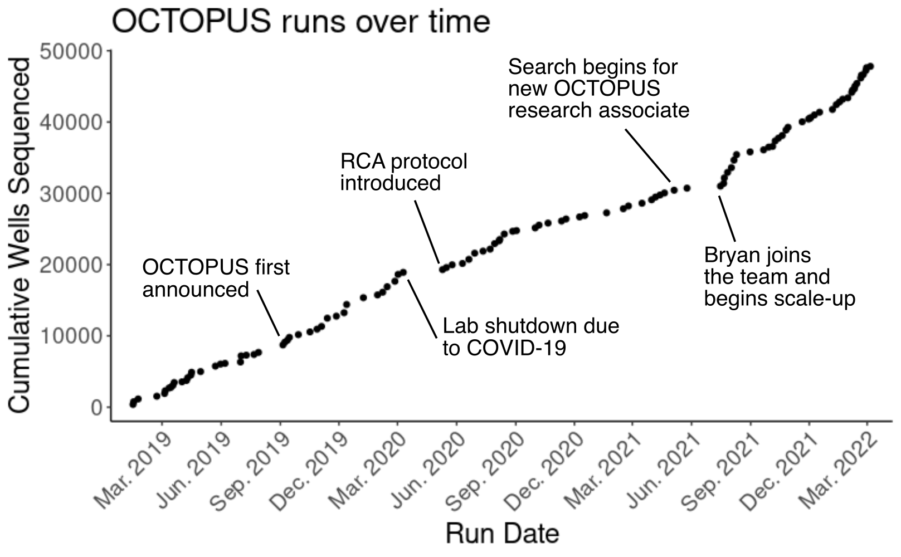
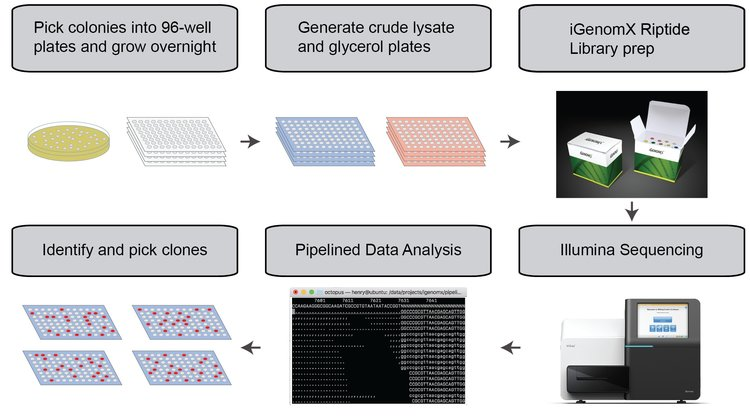

(**O**ptimized **C**loning **T**hrough **O**pen-source **P**ipelined **U**nabridged **S**equencing)

## Getting Started

- [Installation](./docs/Installation.md)
- [Bench Protocol](./docs/Bench-Protocol.md)
- [Running the Analysis Pipeline](./docs/Running-the-Analysis-Pipeline.md)

## What is OCTOPUS?

OCTOPUS is a light-weight, cost-effective, and robust method for full-plasmid sequence verification using next-generation sequencing.
This respository provides both the bench protocol and complete source code to allow anyone to run this plasmid sequencing pipeline for themselves.

You can read more about the story of OCTOPUS in our [2022 blog post](https://www.octant.bio/blog-posts/octopus), but it's worth summarizing a few features that make OCTOPUS stand out:

- Scalable: one research associate can sequence hundreds—or even thousands—of colonies a week
- Inexpensive: around $5 a sample
- Robust: our RCA-based protocol performs exceedingly well and automated QC can detect common colony-picking errors
- Easy: OCTOPUS can be performed at scale with common lab equipment (no upfront capital investment in esoteric instruments)
- Straighforward: OCTOPUS works directly off of picked colonies and crude lysates (no automated DNA purification required)

Did we mention scalable? OCTOPUS has allowed us to sequence thousands of colonies a month for over three years.

### How OCTOPUS Works

OCTOPUS is divided into six main steps.
1. Colony picking and glycerol stock setup
2. Overnight growth and lystate generation (_or rolling circle amplication_)
3. iGenomX Riptide kit library preparation
4. Illumina sequencing
5. Turn-key data analysis
6. Pick perfect sequences

Interested in learning more?
[Check out our documentation for more information](./docs/).

## Contributing

We welcome any feedback to help make OCTOPUS better!
If you encounter problems while running this pipeline or have suggestions for further improvements, please open an issue using our [issue tracker](https://github.com/octantbio/octopus/issues).

Pull requests are also welcome.

## License

This project is licensed under the Apache 2.0 License - see the [LICENSE](LICENSE) file for details. Additional licensing information:

- [BBTools](docker/bbtools-license) - custom
- [mlr](docker/mlr-license) - custom
- [starcode](docker/starcode-license) - GPL-3.0
- [SPAdes](docker/spades-license) - GPL-2.0
- [fgbio](https://github.com/fulcrumgenomics/fgbio/blob/master/LICENSE) - MIT
- [minimap2](https://github.com/lh3/minimap2/blob/master/LICENSE.txt) - MIT
- [samtools](https://github.com/samtools/samtools/blob/develop/LICENSE) - MIT
- [bcftools](https://github.com/samtools/bcftools/blob/develop/LICENSE) - MIT
- [htslib](https://github.com/samtools/htslib/blob/develop/LICENSE) - MIT
- [freebayes](https://github.com/ekg/freebayes/blob/master/LICENSE) - MIT

